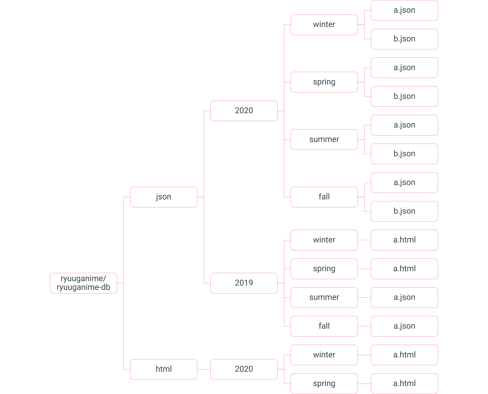

# Sebelum Melanjutkan

## Sistem [Hirarki](../ketentuan-umum/definisi-kata/#hirarki-hierarki) [Repositori](../ketentuan-umum/definisi-kata/#repositori-kendali-versi)

Bentuk hirarki berkas yang digunakan dalam repositori [database](../ketentuan-umum/definisi-kata/#database-pangkalan-data) adalah sebagai berikut:

Dengan merujuk:

* [`ryuuganime/ryuuganime-db`](https://github.com/ryuuganime/ryuuganime-db) merupakan file repositori yang telah di-_clone_ ke mesin;
* [`json` ](../ketentuan-umum/definisi-kata/definisi-format-berkas.md#json)dan [`html`](../ketentuan-umum/definisi-kata/definisi-format-berkas.md#html) merupakan folder pembagian format;
* `2020` dan `2019` merupakan klasifikasi data berdasarkan tahun;
* `winter`, `spring`, `summer`, dan `fall` merupakan klasifikasi data berdasarkan musim penayangan animasi di Jepang; dan
* `a.json`, `b.json`, `a.html`, dan `b.html` merupakan data informasi anime.


Walaupun dalam grafis hirarki yang digunakan maupun dalam repositori mempunyai format [html](../ketentuan-umum/definisi-kata/definisi-format-berkas.md#html) yang tidak digunakan lagi, berkas tersebut hanya menjadi data cadangan.


## Penulisan Judul Berkas dan Tata Letak Berkas

Penulisan judul berkas ini mungkin terlihat lumayan rumit, karena mempunyai regulasi tertentu.

Berikut adalah regulasi cara penulisan judul dan tata letak berkas. 


WIP _desu_~~


